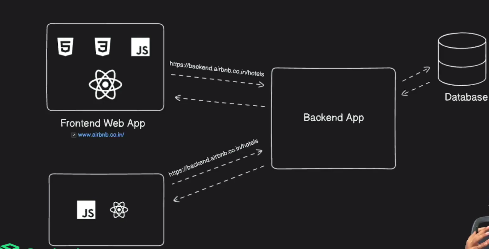

## Understanding how front-end and backend interact with REST API



### Step-by-step process of interaction between frontend and backend using REST API:

User clicks button
↓
Frontend sends API request
↓
Backend processes request
↓
Database queried
↓
Backend returns response
↓
Frontend updates UI

## HTTP vs HTTPS

| Feature         | HTTP                           | HTTPS                                             |
| --------------- | ------------------------------ | ------------------------------------------------- |
| Full form       | HyperText Transfer Protocol    | HyperText Transfer Protocol Secure                |
| Security        | Not secure                     | Secure using SSL/TLS encryption                   |
| Data transfer   | Plain text                     | Encrypted data                                    |
| URL starts with | `http://`                      | `https://`                                        |
| Default port    | 80                             | 443                                               |
| Certificate     | Not required                   | Requires SSL/TLS certificate                      |
| Protection      | Vulnerable to hacking/sniffing | Protects against interception and tampering       |
| Usage           | Basic websites, testing        | Banking, shopping, login systems, modern websites |

### How HTTPS Works

HTTPS uses **SSL/TLS encryption** to:

- Encrypt data between browser and server
- Verify website identity
- Protect passwords, payment info, and personal data

### Example

- HTTP: `http://example.com`
- HTTPS: `https://example.com`

### Key Difference

In HTTP, anyone intercepting the connection can read the data.
In HTTPS, the data is encrypted and secure.

### Simple Analogy

- **HTTP** = Sending a postcard (anyone can read it)
- **HTTPS** = Sending a sealed envelope (private and secure)

## Fetch

- A JavaScript API for making HTTP requests from the frontend to the backend.
- Returns a promise that resolves to the response of the request.
- Example:

`````javascript
fetch("https://jsonplaceholder.typicode.com/users")
  .then((res) => res.json())
  .then((data) => console.log(data));
### Fetch Apis

- API stands for Application Programming Interface, which is a set of rules and protocols for building and interacting with software applications.
- It provides an interface for fetching(sending/receiving) resources .
- It uses Requests and Responses objects to handle the data.
- It is based on Promises, making it easier to work with asynchronous operations.
- The fetch() method is used to fetch resources from the network.

Syntax:

````javascript
let promise = fetch(url,[options]);
```- `url`: The URL of the resource you want to fetch.
- `options`: An optional object containing any custom settings that you want to apply to the request. It can include:
  - `method`: The HTTP method to use (e.g., GET, POST, PUT, DELETE).
  - `headers`: An object containing any custom headers you want to include in the request.
  - `body`: The body of the request, typically used for POST or PUT requests.
  - `mode`: The mode of the request (e.g., cors, no-cors, same-origin). etc.

`````

```js
const url = "https://cat-fact.herokuapp.com";

let promise = fetch(url);
console.log(promise);
```

```js
const getFacts = async () => {
  console.log("Fetching data...");
  let response = await fetch(url);
  console.log(promise);
};
```

- AJAX is Asynchronous js and xml.
- JSON is Javascript Object Notation.

json() method : returns a second promise that resolves with the result of parsing the response body text as JSON.(input is json ,output is js object)

- Response is in json and it should be converted to js object using json() method.
- fetch is asynchronous and returns first promise and json() method is also asynchronous and returns second promise.

//using promise chaining

```js
function getFats() {
  fetch(url)
    .then((response) => {
      return response.json();
    })
    .then((data) => {
      console.log(data);
    });
}
```

// using async await

```js
const getFacts = async () => {
  console.log("Fetching data...");
  let response = await fetch(url);
  console.log(response);// JSON Format
let data = await response.json():
console.log(data);// JS Object
};
```

## Rest API (Representational State Transfer)

- A set of rules for building APIs that allow communication between frontend and backend.
- Uses HTTP methods (GET, POST, PUT/PATCH, DELETE) to perform CRUD operations on resources.

| Method    | Purpose     |
| --------- | ----------- |
| GET       | Fetch data  |
| POST      | Create data |
| PUT/PATCH | Update data |
| DELETE    | Remove data |

### Request Contains

- URL
- Headers
- Body

## URL

- Endpoint of the API
- Example: https://api.example.com/users
- Can include query parameters: https://api.example.com/users?age=30
- Can include path parameters: https://api.example.com/users/123
- Can include request body (for POST/PUT/PATCH): { "name": "John", "age": 30 }
- Can include headers:
- The URL, headers, and body together define the API request that the frontend sends to the backend to perform a specific action (e.g., fetch users, create a new user, update user information, delete a user).

## Headers

- Metadata about the request
- Headers can include authentication tokens, content type, etc. { "Content-Type": "application/json", "Authorization": "Bearer token" }
- Example: Content-Type, Authorization
- Can include authentication tokens, content type, etc.
- Example: { "Content-Type": "application/json", "Authorization": "Bearer token" }
- Headers are key-value pairs sent along with the API request to provide additional information about the request, such as the type of data being sent (Content-Type) or authentication credentials (Authorization).
- Headers help the backend understand how to process the request and what kind of response to return.
- For example, the Content-Type header tells the backend that the request body is in JSON format, while the Authorization header provides a token that the backend can use to verify the identity of the requester.

## Body

- Data sent in the request (for POST/PUT/PATCH)
- Example: { "name": "John", "age": 30 }
- The body of an API request contains the data that the frontend wants to send to the backend when creating or updating resources. It is typically used with POST, PUT, or PATCH methods.
- The body is often formatted as JSON, but it can also be in other formats such as XML or form data, depending on the API's requirements and the Content-Type header specified in the request.
- For example, when creating a new user, the frontend might send a POST request with a JSON body containing the user's name and age, like this: { "name": "John", "age": 30 }.
- The backend will then process this data, create a new user in the database, and return a response indicating whether the operation was successful or if there were any errors.

## Response

- Data sent back from the backend to the frontend after processing the request.

### Response Contains

- Status code
- JSON data

## JSON Data

- JavaScript Object Notation
- A lightweight data format used for exchanging data between frontend and backend.
- Example: { "id": 1, "name": "John", "age": 30 }
- The backend typically returns data in JSON format, which is easy for the frontend to parse and use to update the user interface. For example, when fetching a list of users, the backend might return a JSON array of user objects, like this: [{ "id": 1, "name": "John", "age": 30 }, { "id": 2, "name": "Jane", "age": 25 }].
- The frontend can then use this data to display the list of users on the screen, allowing the user to see the information retrieved from the backend. JSON is a widely used format for data exchange in web applications due to its simplicity and compatibility with JavaScript.

### Common Status Codes

- Status codes indicate the result of the API request. They are categorized into different classes:

- | Code | Meaning      |
  | ---- | ------------ |
  | 200  | Success      |
  | 201  | Created      |
  | 400  | Bad request  |
  | 401  | Unauthorized |
  | 404  | Not found    |
  | 500  | Server error |

Url -> ("https://localhost:5000/api/user")
Method->POST
Headers-> { "Content-Type": "application/json", "Authorization": "Bearer token" }
Body-> { "name": "John", "age": 30 }  
Response-> { "id": 1, "name": "John", "age": 30 }

response body :{
success: true,
data: {
id: 1,
name: "John",  
age: 30
}
}

// response body for fetching users:
data: [
{
id: 1,
name: "John",
age: 30
},
{
id: 2,
name: "Jane",
age: 25
}]

Example:

fetch("https://jsonplaceholder.typicode.com/users")
.then(res => res.json())
.then(data => console.log(data))

Then explain:

fetch(URL)

→ frontend sending request

res.json()

→ converting response to JSON

console.log(data)

→ using backend data

# Create User API

## Endpoint

```http
POST https://localhost:5000/api/users
```

---

## Headers

| Key           | Value            |
| ------------- | ---------------- |
| Content-Type  | application/json |
| Authorization | Bearer token     |

---

## Request Body

```json
{
  "name": "John",
  "age": 30
}
```

---

## Fetch API Example

```javascript
fetch("https://localhost:5000/api/users", {
  method: "POST",
  headers: {
    "Content-Type": "application/json",
    Authorization: "Bearer token",
  },
  body: JSON.stringify({
    name: "John",
    age: 30,
  }),
})
  .then((response) => response.json())
  .then((data) => {
    console.log("Response:", data);
  })
  .catch((error) => {
    console.error("Error:", error);
  });
```

---

## Success Response

### Status Code

```http
200 OK
```

### Response Body

```json
{
  "success": true,
  "data": {
    "id": 1,
    "name": "John",
    "age": 30
  }
}
```

---

## Error Response Example

```json
{
  "success": false,
  "message": "Invalid request data"
}
```

## Example React Component Fetching Data from REST API

```javascript
import { useEffect, useState } from "react";

export default function App() {
  const [users, setUsers] = useState([]);

  useEffect(() => {
    fetch("https://jsonplaceholder.typicode.com/users")
      .then((res) => res.json())
      .then((data) => setUsers(data));
  }, []);

  return (
    <div>
      <h1>Users</h1>

      {users.map((user) => (
        <p key={user.id}>{user.name}</p>
      ))}
    </div>
  );
}
```

## Debugging Tips

- Check the network tab in browser dev tools to see API requests and responses.
- Use console.log to inspect data at different stages of the request.
- Handle errors gracefully using .catch() in fetch or try-catch in async/await.
- Ensure CORS (Cross-Origin Resource Sharing) is properly configured on the backend if frontend and backend are on different domains.
- Use tools like Postman to test API endpoints independently of the frontend.
- Check for correct HTTP methods and status codes in the backend response.
- Verify that the backend is running and accessible at the expected URL.
- Ensure that the request body is correctly formatted (e.g., JSON.stringify for POST/PUT requests).
- Check for any authentication or authorization requirements for the API endpoints.
- Review the API documentation for correct endpoint usage and expected request/response formats.
- Use browser extensions like RESTer or RESTClient for quick API testing without leaving the browser.

## Network Tab (VERY IMPORTANT)

- Request URL: Where request is going.

Method

GET / POST etc.

# Status Code :

200, 404, 500.

# Headers :

Authorization, content-type.

# Payload: Data frontend sends.

# Preview/Response :Data backend returns.

## Example using async/await:

async function getUsers() {
try {
const res = await fetch("https://jsonplaceholder.typicode.com/users");

    if (!res.ok) {
      throw new Error("API failed");
    }

    const data = await res.json();

    console.log(data);

} catch (err) {
console.error(err);
}
}

##CORS (Cross-Origin Resource Sharing)

- It is a browser security rule that decidesCan this frontend access this backend?
-
- CORS is a security feature implemented by browsers to restrict web pages from making requests to a different domain than the one that served the web page.
- If the frontend and backend are on different domains, the backend must include appropriate CORS headers (e.g., Access-Control-Allow-Origin) to allow the frontend to access the API.
- If CORS is not properly configured, the browser will block the API request, and you will see a CORS error in the console.
  An origin is made of:
- Protocol + Domain + Port

Example:

URL Origin
http://localhost:3000 frontend
http://localhost:5000 backend

Ports are different:

3000
5000

So browser says:

Different origin detected
This becomes a cross-origin request.

fetch("http://localhost:5000/users")

- If backend did NOT allow it:
- Browser blocks response
- The request usually REACHES backend.But browser blocks frontend from reading response.

### Backend must send special headers.

Example:

Access-Control-Allow-Origin: http://localhost:3000
Frontend → wants entry
Browser → security guard
Backend → gives permission

If backend says:

“allowed” → browser lets response through
“not allowed” → blocked

## to allow CORS in Express.js backend:

const express = require("express");
const cors = require("cors");

const app = express();

app.use(cors());

- Now backend allows all origins.

## to allow this frontend to access backend, we need to allow CORS in backend:

app.use(
cors({
origin: "http://localhost:3000"
})
);
Only this frontend allowed.

# REST API Debugging Tools

## 1. Postman

Official Website: https://www.postman.com

### Features

- Send GET, POST, PUT, DELETE requests
- Test authentication (JWT, OAuth, API keys)
- Save collections
- Environment variables
- Automated API tests
- View headers, cookies, and response times

### Best For

- Beginners to advanced developers
- Manual API testing
- Team collaboration

---

## 2. Insomnia

Official Website: https://insomnia.rest

### Features

- Simple and clean UI
- REST and GraphQL support
- Environment management
- Plugin system

### Best For

- Developers wanting a lightweight interface

---

## 3. Swagger UI / OpenAPI

Official Website: https://swagger.io/tools/swagger-ui/

### Features

- Interactive API documentation
- Test endpoints directly from browser
- Auto-generated docs from OpenAPI specs

### Best For

- Backend teams
- API documentation and testing

---

## 4. cURL

Official Website: https://curl.se

### Example

```bash
curl -X GET https://api.example.com/users
```

Here’s a simple example of integrating an API in a plain JavaScript application and rendering the data using only **HTML, CSS, and JavaScript** (no React).

This example fetches users from the free API:
`https://jsonplaceholder.typicode.com/users`

---

# 1. HTML (`index.html`)

```html
<!DOCTYPE html>
<html lang="en">
  <head>
    <meta charset="UTF-8" />
    <meta name="viewport" content="width=device-width, initial-scale=1.0" />
    <title>API Integration Example</title>
    <link rel="stylesheet" href="style.css" />
  </head>
  <body>
    <h1>User List</h1>

    <div id="users-container">
      <!-- Users will be added here -->
    </div>

    <script src="script.js"></script>
  </body>
</html>
```

---

# 2. CSS (`style.css`)

```css
body {
  font-family: Arial, sans-serif;
  background-color: #f4f4f4;
  padding: 20px;
}

h1 {
  text-align: center;
}

#users-container {
  display: grid;
  grid-template-columns: repeat(auto-fit, minmax(250px, 1fr));
  gap: 20px;
  margin-top: 20px;
}

.user-card {
  background: white;
  padding: 15px;
  border-radius: 10px;
  box-shadow: 0 2px 5px rgba(0, 0, 0, 0.1);
}

.user-card h3 {
  margin-bottom: 10px;
  color: #333;
}

.user-card p {
  margin: 5px 0;
  color: #666;
}
```

---

# 3. JavaScript (`script.js`)

```javascript
// API URL
const apiUrl = "https://jsonplaceholder.typicode.com/users";

// Select container
const usersContainer = document.getElementById("users-container");

// Fetch API data
fetch(apiUrl)
  .then((response) => response.json())
  .then((users) => {
    // Loop through users
    users.forEach((user) => {
      // Create div
      const userCard = document.createElement("div");
      userCard.classList.add("user-card");

      // Add HTML content
      userCard.innerHTML = `
        <h3>${user.name}</h3>
        <p><strong>Email:</strong> ${user.email}</p>
        <p><strong>City:</strong> ${user.address.city}</p>
      `;

      // Append to container
      usersContainer.appendChild(userCard);
    });
  })
  .catch((error) => {
    console.log("Error fetching data:", error);
  });
```

---

# How This Works

## Step 1 — `fetch()` sends request to API

```javascript
fetch(apiUrl);
```

This requests data from the server.

---

## Step 2 — Convert response to JSON

```javascript
response.json();
```

API response comes in JSON format.

---

## Step 3 — Loop through data

```javascript
users.forEach((user) => {});
```

Iterates through each user object.

---

## Step 4 — Create HTML dynamically

```javascript
document.createElement("div");
```

Creates HTML elements using JavaScript.

---

## Step 5 — Render on webpage

```javascript
usersContainer.appendChild(userCard);
```

Adds cards into the webKpage.

---

# Output

You’ll see user cards like:

- Name
- Email
- City

displayed in a responsive grid layout.

---

# Folder Structure

```plaintext
project-folder/
│
├── index.html
├── style.css
└── script.js
```

---

# Modern Async/Await Version (Cleaner)

You can also write API integration like this:

```javascript
async function getUsers() {
  try {
    const response = await fetch(apiUrl);
    const users = await response.json();

    users.forEach((user) => {
      const card = document.createElement("div");

      card.classList.add("user-card");

      card.innerHTML = `
        <h3>${user.name}</h3>
        <p>${user.email}</p>
      `;

      usersContainer.appendChild(card);
    });
  } catch (error) {
    console.log(error);
  }
}

getUsers();
```

---

# Real Applications Use APIs For

- Login systems
- Weather apps
- E-commerce products
- Payment systems
- Social media feeds
- Maps & locations
- Chat applications

## GraphQL

- An alternative to REST APIs that allows clients to request only the data they need.
- Clients can specify the structure of the response, reducing over-fetching and under-fetching of data.
- Uses a single endpoint for all requests, unlike REST which has multiple endpoints for different resources.
- Developed by Facebook and widely adopted in modern web applications.
- Example query:

```graphql
{
  user(id: 1) {
    name
    email
  }
}
```

## Differences between REST and GraphQL

| Feature        | REST API                                     | GraphQL                                                |
| -------------- | -------------------------------------------- | ------------------------------------------------------ |
| Endpoint       | Multiple endpoints for resources             | Single endpoint for all requests                       |
| Data Fetching  | Fixed data structure                         | Client specifies data structure                        |
| Over-fetching  | Common issue (fetches more data than needed) | No over-fetching (fetches only requested data)         |
| Under-fetching | Common issue (fetches less data than needed) | No under-fetching (client can request all needed data) |
| Versioning     | Versioned APIs (e.g., v1, v2)                | No versioning (schema evolves over time)               |
| Caching        | Easier to cache responses                    | More complex caching due to flexible queries           |
| Learning Curve | Easier for beginners                         | Steeper learning curve                                 |
